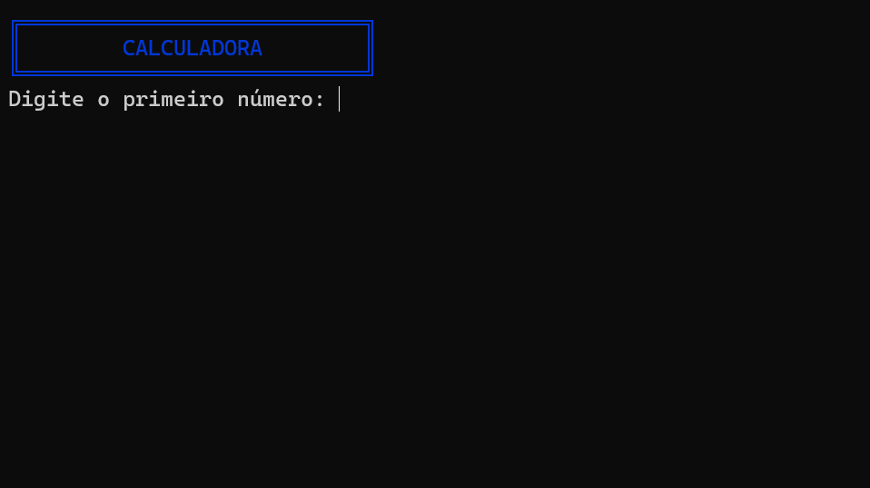

# Calculadora em C#

Este projeto é uma calculadora simples desenvolvida em C# que permite ao usuário realizar operações matemáticas básicas: adição, subtração, multiplicação e divisão.

## 🚀 Funcionalidades

- ✅ Entrada de dois números pelo usuário.
- ✅ Escolha da operação matemática (1 - Adição, 2 - Subtração, 3 - Multiplicação, 4 - Divisão).
- ✅ Validação da entrada do usuário.
- ✅ Tratamento de erro para divisão por zero.
- ✅ Exibição do resultado formatado no console.

## 📂 Estrutura do Projeto

### 📦 CalculadoraApp

- ┣ 📜 Program.cs         Ponto de entrada da aplicação
- ┣ 📜 Calculadora.cs     Classe responsável pelas operações matemáticas
- ┗ 📜 README.md          Documentação do projeto

### 🛠 Tecnologias Utilizadas

- C#

- .NET Core/Framework

- Console Application

### 📌 Como Executar o Projeto

1️⃣ Clone este repositório:

- git clone https://github.com/seu-usuario/CalculadoraApp.git

2️⃣ Acesse o diretório do projeto:

- cd CalculadoraApp

3️⃣ Compile e execute o programa:

- dotnet run

## 📝 Exemplo de Uso

💡 Sinta-se à vontade para contribuir e sugerir melhorias! 🚀

